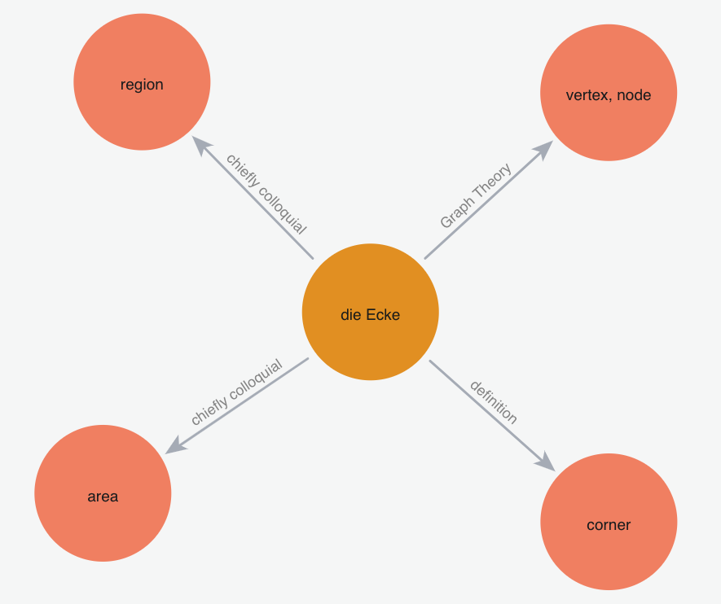
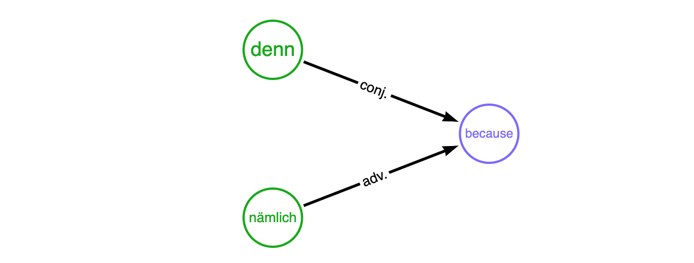

Wilhelm Vocabulary
==================

![GitHub last commit badge][GitHub last commit]
![GitHub workflow status badge][GitHub workflow status]
[![Apache License Badge]](https://www.apache.org/licenses/LICENSE-2.0)

Data Format
-----------

The data that serves [wilhelmlang.com](https://wilhelmlang.com/). They are written in YAML format, because

1. it is machine-readable so that it can be consumed quickly in data pipelines
2. it is human-readable and, thus, easy to modify
3. it supports multi-lines value which is very handy for data of natural languages

How Data (Vocabulary) is Stored in a Graph Database
---------------------------------------------------

### Why Graph Database

Graph data representation assumes universal connectivity among world entities. This applies pretty well to the realm of
languages. Multilanguage learners have already seen that Indo-European languages are similar in many different ways.
The similarities not only signify the historical facts about Philology but also surface a great opportunity for
multilanguage learners to study much more efficiently. What's missing is connecting the dots using Graph Databases that
visually presents these vastly enlightening links between the related languages.

### Definition

_The meaning of a word is called the `definition`_. A term has a natural relationship to its definition(s). For example,
the German noun ["Ecke"](https://en.wiktionary.org/wiki/Ecke#Noun) has at least 4 definitions:



<div align="center">
    Graph data generated by <a href="https://github.com/QubitPi/wilhelm-python-sdk">wilhelm-python-sdk</a>
</div>

[German](./german.yaml)
-----------------------

### YAML Schema

```yaml
vocabulary:
  - term: string
    definition: list
    declension/conjugation: application-specific table
```

- The `conjugation` is the inflection paradigm for a German verb and `declension` the inflection for nouns and
  adjectives. Only one of the two is present for a term.
- The type of the word can be inferred using the following rule

    - `term` with a _definite article_ of __der__/__die__/__das__ signifies a __noun__. For instance

      ```yaml
        - term: die Wissenschaft
          definition: the Science
      ```

    - Those with `conjugation` field denotes a __verb__; its definition also begins with an _indefinite form_, i.e.
      "to ..."
    - The rests are explicitly stated in the `definition` field. For example,

      ```yaml
        - term: ob
          definition:
            - (conj.) if
            - (conj.) whether
      ```

      means "ob" is a **conjunction** in this case and

      ```yaml
        - term: denn
          definition:
            - (adv.) then, thus
            - (conj.) because
      ```

      tells that "denn" can be __adverb__ or __conjunction__

> [!TIP]
>
> The parenthesized value at the beginning of each `definition` item played an un-ignorable role: it is the label of the
> relationship between `term` and `definition` in graph database loaded by
> [Wilhelm SDK](https://github.com/QubitPi/wilhelm-graphdb-python). For example, both German words
>
> ```yaml
> - term: denn
>   definition:
>     - (adv.) then, thus
>     - (conj.) because
> ```
>
> and
>
> ```yaml
>  - term: nämlich
>    definition:
>      - (adj.) same
>      - (adv.) namely
>      - (adv.) because
> ```
>
> can mean "because" acting as different types. This is visualized as follows:
>
> 
>
> __Visualzing synonyms this way presents a big advantage to human brain__ who is exceedingly good at memorizing
> patterns

### German Noun Declension

The declension table employees an [application-specific YAML](https://stackoverflow.com/q/30894438/14312712) that looks like the following:

```yaml
  - term: ein
    definition: (article) a, an
    declension:
      - ["",         masculine, feminine, neuter, plural]
      - [nominative, ein,       eine,     ein,    N/A   ]
      - [genitive,   eines,     einer,    eines,  N/A   ]
      - [dative,     einem,     einer,    einem,  N/A   ]
      - [accusative, einen,     eine,     ein,    N/A   ]
```

The declension table above is equivalent to

|                | masculine | feminine | neuter | plural |
|:--------------:|:---------:|:--------:|:------:|:------:|
| __nominative__ |    ein    |   eine   |  ein   |  N/A   |
|  __genitive__  |   eines   |  einer   | eines  |  N/A   |
|   __dative__   |   einem   |  einer   | einem  |  N/A   |
| __accusative__ |   einen   |   eine   |  ein   |  N/A   |

> [!NOTE]
>
> - A list under `declension` is a table row
> - All rows have the same number of columns
> - Each element of the list corresponds to a table cell

> [!TIP]
>
> __The declension tables for all nouns are sourced from
> [Wiktionary](https://en.wiktionary.org/wiki/ein#Declension_2)__

### German (Attributive) Adjective Declension

> [!TIP]
>
> - Predicate adjectives (e.g. kalt in mir ist kalt "I am _cold_") are undeclined
> - An adjective can both be predicative (a _brave_ boy) or attributive (The boy is _brave_). Only attributive
>   adjectives are declined.

There are 3 types of declensions for German adjectives

1. [strong declension](https://en.wikipedia.org/wiki/German_declension#Strong_inflection),
2. [week declension](https://en.wikipedia.org/wiki/German_declension#Weak_inflection), and
3. [mixed declension](https://en.wikipedia.org/wiki/German_declension#Mixed_inflection)

Each type bears a separate declension table. __To master German adjectives, we will need to memorize all of the three__.

There is also [adjective comparison](https://en.wikipedia.org/wiki/German_adjectives#Adjective_comparison) which throws
in potentially 6 more tables. But the
[rules for comparative and superlative forms are quite universal](https://www.reddit.com/r/German/comments/i5mfrq/how_do_you_remember_adjective_declension/)
so we __ignore the two and focus only on the positive form__, which is the basic form of the adjective.

Here is an example of the adjective declension used in this repository:

```yaml
  - term: unterschiedlich
    definition: (adj.) different
    declension:
      - strong declension (without article):
        - ["",         singular,          singular,          singular,          plural           ]
        - ["",         masculine,         feminine,          neuter,            ""               ]
        - [nominative, unterschiedlicher, unterschiedliche,  unterschiedliches, unterschiedliche ]
        - [genitive,   unterschiedlichen, unterschiedlicher, unterschiedlichen, unterschiedlicher]
        - [dative,     unterschiedlichem, unterschiedlicher, unterschiedlichem, unterschiedlichen]
        - [accusative, unterschiedlichen, unterschiedliche,  unterschiedliches, unterschiedliche ]
      - weak declension (with definite article):
        - ["",         singular,              singular,              singular,              plural               ]
        - ["",         masculine,             feminine,              neuter,                ""                   ]
        - [nominative, der unterschiedliche,  die unterschiedliche,  das unterschiedliche,  die unterschiedlichen]
        - [genitive,   des unterschiedlichen, der unterschiedlichen, des unterschiedlichen, der unterschiedlichen]
        - [dative,     dem unterschiedlichen, der unterschiedlichen, dem unterschiedlichen, den unterschiedlichen]
        - [accusative, den unterschiedlichen, die unterschiedliche,  das unterschiedliche,  die unterschiedlichen]
      - mixed declension (with indefinite article):
        - ["",         singular,                singular,                singular,                plural                    ]
        - ["",         masculine,               feminine,                neuter,                  ""                        ]
        - [nominative, ein unterschiedlicher,   eine unterschiedliche,   ein unterschiedliches,   (keine) unterschiedlichen ]
        - [genitive,   eines unterschiedlichen, einer unterschiedlichen, eines unterschiedlichen, (keiner) unterschiedlichen]
        - [dative,     einem unterschiedlichen, einer unterschiedlichen, einem unterschiedlichen, (keinen) unterschiedlichen]
        - [accusative, einen unterschiedlichen, eine unterschiedliche,   ein unterschiedliches,   (keine) unterschiedlichen ]
```

> [!TIP]
>
> __The declension tables for all adjectives are sourced from
> [Wiktionary](https://en.wiktionary.org/wiki/unterschiedlich#Declension)__

### German Verb Conjugation

There are __3__ persons, __2__ numbers, and __4__ moods (indicative, conditional, imperative and subjunctive) to
consider in conjugation. There are __6__ tenses in German: the present and past are conjugated, and there are four
compound tenses. There are two categories of verbs in German:
[weak and strong](https://en.wikipedia.org/wiki/Germanic_strong_verb)[^1]. In addition,
[strong verbs are grouped into 7 "classes"](https://en.wikipedia.org/wiki/Germanic_strong_verb#Strong_verb_classes)

[^1]: https://en.wikipedia.org/wiki/German_verbs#Conjugation

The conjugation table of German verb on Wiktionary is hard to interpret for German beginner. It does, however, presents
a very good Philology reference. For example, it tells us which of the 7 "classes" a strong verb belongs to. __We,
therefore, leave the Wiktionary links to the conjugation table of that verb for data processing in the future__, for
example,

```yaml
  - term: aufwachsen
    definition: to grow up
    conjugation: https://en.wiktionary.org/wiki/aufwachsen#Conjugation
```

and advise user to employ a much more practical method to learn daily conjugation as follows. We take "__aufwachsen__"
as an example.

> [!IMPORTANT]
> I'm not advertising for any organizations. I'm simply sharing good resources.

[Netzverb Dictionary](https://www.verbformen.com/) is the best German dictionary _targeting the vocabulary inflections_.
[Search for "aufwachsen"](https://www.verbformen.com/?w=aufwachsen) and we will see much more intuitive conjugation
tables listed.

This pretty much serves our needs, but what makes Netzverb unpenetrable by other alternatives is that _every_ verb comes
with

1. [A printable version that looks much better than the browser's Control+P export](https://www.verbformen.com/conjugation/aufwachsen.pdf)

   - There is also a "Sentences with German verb aufwachsen" section with a
     [link](https://www.verbformen.com/conjugation/examples/aufwachsen.htm) that offer a fruitful number of conjugated
     examples getting us familiar with the inflections of the verb

2. [An on-the-fly generated flashcard sheet](https://www.verbformen.com/conjugation/worksheets-exercises/lernkarten/aufwachsen.pdf)
   which allows us to make a better usage of our random free time
3. [A YouTube video that offers audios of almost every conjugated form](https://www.youtube.com/watch?v=LCtUrSn030A),
   which helps with pronunciations a lot

> [!TIP]
> - __It is, thus, strongly recommended to study the conjugation through
>   [Netzverb Dictionary](https://www.verbformen.com/) separately__
> - Netzverb Dictionary, however, lacks a programmable API. Wiktionary [has a good one](https://dumps.wikimedia.org/)
>   instead. This is why we left the conjugation link to Wiktionary for now and it will definitely serve us well as I'm
>   trying to make it happen

[Ancient Greek](./greek.yaml)
-----------------------------

```yaml
vocabulary:
  - term: string
    definition: list
```

[Wiktionary is the best source for Attic pronunciation](https://en.wiktionary.org/wiki/%CE%B1%E1%BD%90%CF%84%CF%8C%CF%82#Pronunciation),
although [some words are missing the audio](https://en.wiktionary.org/wiki/%CE%BA%CE%B1%CE%AF#Pronunciation). Due to the
scarcity of the audio resources among AG lerners, [a separate project](https://github.com/QubitPi/ancient-greek-reader)
has been initiated to expand the audio practice materials by AI

[Latin](./latin.yaml)
---------------------

```yaml
vocabulary:
  - term: string
    definition: list
```

Classical Hebrew (Coming Soon)
------------------------------

The vocabulary is presented to help read and understand [Biblical Hebrew](https://mechon-mamre.org/p/pt/pt00.htm#mp3). A
[complementary audio](https://mechon-mamre.org/p/pt/ptmp3prq.htm) helps well with the pronunciation.

[Korean](./korean.yaml)
-----------------------

中国人学习韩语有先天优势，加之韩语本身也是一门相当简单的语言，所以这里将语法和词汇合并在一起；
每一项也只由 `term`（韩）和 `definition`（中）组成，

```yaml
vocabulary:
  - term: string
    definition: list
```

不用费太多功夫记牢简单的语法和词汇，剩下的就是拿韩语字幕剧不停练习听说读写既成。

> [!NOTE]
>
> 韩语不属于汉藏语系，因其所属语系非常狭小，无法和其它语言产生足够关联，因此其数据暂时不被存入图数据库进行数据分析

License
-------

The use and distribution terms for [wilhelm-vocabulary]() are covered by the [Apache License, Version 2.0].

[Apache License Badge]: https://img.shields.io/badge/Apache%202.0-F25910.svg?style=for-the-badge&logo=Apache&logoColor=white
[Apache License, Version 2.0]: http://www.apache.org/licenses/LICENSE-2.0.html

[GitHub last commit]: https://img.shields.io/github/last-commit/QubitPi/wilhelm-vocabulary/master?logo=github&style=for-the-badge
[GitHub workflow status]: https://img.shields.io/github/actions/workflow/status/QubitPi/wilhelm-vocabulary/ci-cd.yaml?branch=master&logo=github&style=for-the-badge
