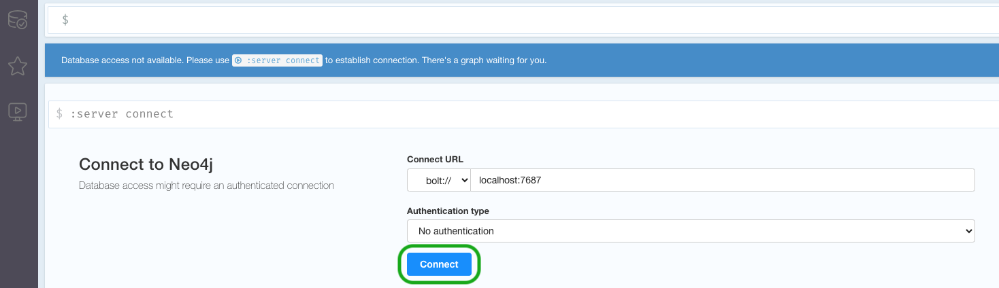
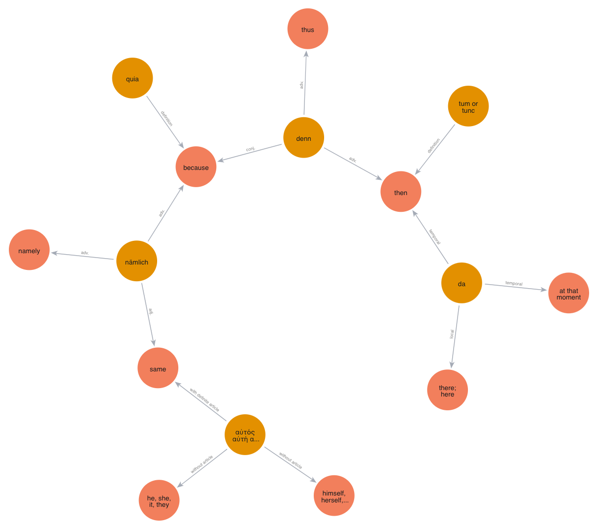
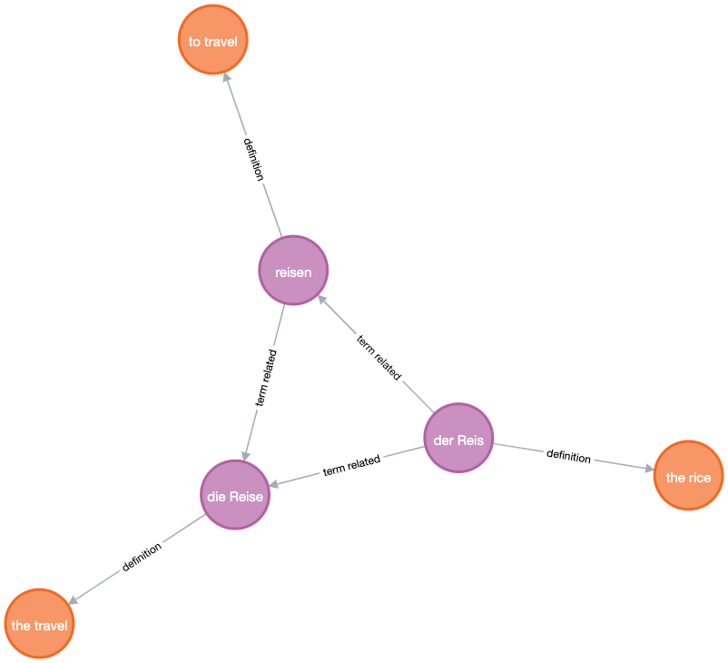
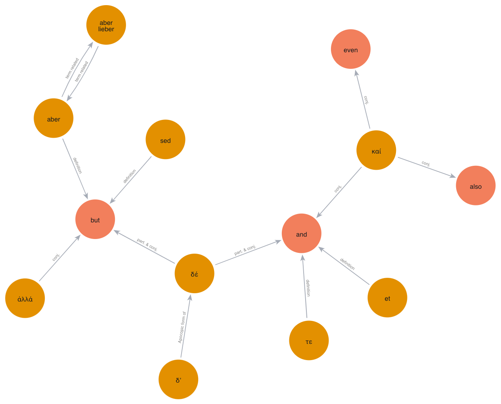
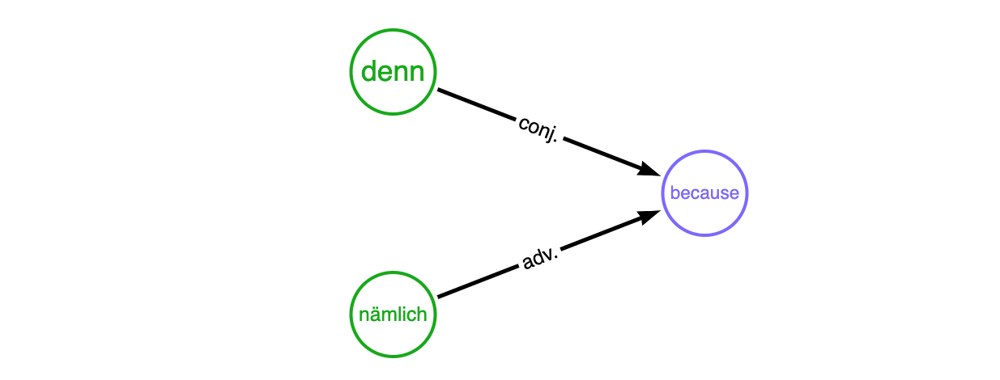
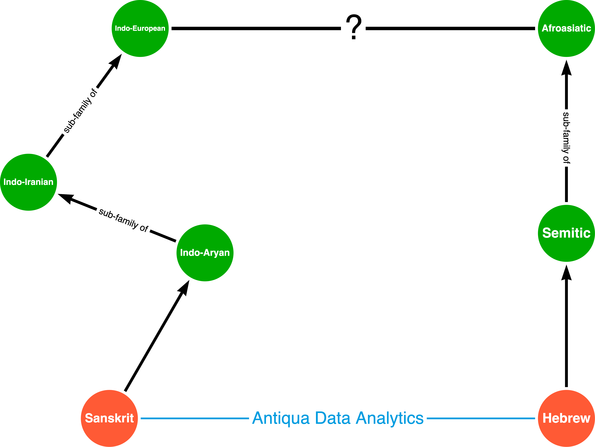

Antiqua
=======

[![Hugging Face dataset badge]][Hugging Face dataset URL]
[![Docker Hub][Docker Pulls Badge]][Docker Hub URL]
[![PyPI][PyPI project badge]][PyPI project url]

[![GitHub workflow status badge Antiqua][GitHub workflow status badge Antiqua]][GitHub workflow status URL Antiqua]
[![GitHub workflow status badge GDL][GitHub workflow status badge GDL]][GitHub workflow status URL GDL]
[![Hugging Face sync status badge]][Hugging Face sync status URL]

![Python Version][Python Version Badge]
[![Apache License Badge]][Apache License, Version 2.0]

Believing in language is the greatest invention in human history, __Antiqua__ is an effort of natural language
vocabulary datafication with the goal of __unleashing the power of languages beyond their semantic values for
_people___. It achieves this by 2 parts:

1. __Language ➡ Data__: maintaining vocabulary as data in a unified, human-readable, and machine-readable format
   ([YAML](https://en.wikipedia.org/wiki/YAML)):

    - [german.yaml](./german.yaml)
    - [latin.yaml](./latin.yaml)
    - [ancient-greek.yaml](./ancient-greek.yaml)

2. __Data ➡ Value__: exposing the data for language learners in various forms and platforms, including

   - _Anki Flashcards_, useful for __language learners__ using popular platform [Anki](https://apps.ankiweb.net/)

     - Special case: The Ancient Greek Anki cards are handled by [lexitheras](https://github.com/QubitPi/lexitheras)

   - 🤗 [_Hugging Face Datasets_][Hugging Face dataset URL], which can be used widely in __language model trainings__. The
     data can be accessed with

     ```python
     from datasets import load_dataset
     dataset = load_dataset("QubitPi/Antiqua")
     ```

     📗 If `dataset = load_dataset("QubitPi/Antiqua")` throws an error, please upgrade the `datasets` package to its
     _latest version_

   - [_Graph database_](./graph-database-loader) that helps people visually __explore and discover the
     [inter-langauge connections](#connection-between-hebrew-and-sanskrit)__ via knowledge graph. In addition, a
     Docker image has been made to allow us exploring the vocabulary in Neo4J browser backed by a Neo4J  database. To
     get the image and run the container, simply do:

     ```console
     docker run \
         --publish=7474:7474 \
         --publish=7687:7687 \
         --env=NEO4J_AUTH=none \
         --env=NEO4J_ACCEPT_LICENSE_AGREEMENT=yes \
         -e NEO4JLABS_PLUGINS=\[\"apoc\"\] \
         --env NEO4J_browser_remote__content__hostname__whitelist=https://raw.githubusercontent.com \
         --env NEO4J_browser_post__connect__cmd="style https://raw.githubusercontent.com/QubitPi/Antiqua/refs/heads/master/graphstyle.grass" \
         jack20191124/antiqua
     ```

     - When container starts, access neo4j through browser at http://localhost:7474
     - Both __bolt://__ and __neo4j://__ protocols are fine.
     - Choose __No authentication__ for _Authentication type_
     - Then hit __Connect__ as shown below

     

     We have offered some queries that can be used to quickly explore the vocabulary in graph representations:

     - Search for all Synonyms: `MATCH (term:Term)-[r]-(synonym:Term) WHERE r.name = "synonym" RETURN term, r, synonym`
     - Finding all [gerunds](https://en.wiktionary.org/wiki/Appendix:Glossary#gerund):
       `MATCH (source)-[link:RELATED]->(target) WHERE link.name = "gerund of" RETURN source, link, target;`
     - Expanding a word "nämlich" (reveals its relationship to other languages):

       ```cypher
       MATCH (term:Term{label:'nämlich'})
       CALL apoc.path.expand(term, "LINK", null, 1, 3)
       YIELD path
       RETURN path, length(path) AS hops
       ORDER BY hops;
       ```

       

     - In German, "rice" and "travel" are related:

       ```cypher
       MATCH (term:Term{label:'die Reise'})
       CALL apoc.path.expand(term, "LINK", null, 1, 3)
       YIELD path
       RETURN path, length(path) AS hops
       ORDER BY hops;
       ```

       

     - `MATCH (term:Term{label:'die Schwester'})  CALL apoc.path.expand(term, "LINK", null, 1, -1)  YIELD path  RETURN path, length(path) AS hops  ORDER BY hops;`
     - How German, Latin, and Ancient greek expresses the conjunction "but":

       ```cypher
       MATCH (node{label:"δέ"})
       CALL apoc.path.expand(node, "LINK", null, 1, 4)
       YIELD path
       RETURN path, length(path) AS hops
       ORDER BY hops;
       ```

       

Development
-----------

<details><summary>Table of Contents</summary>

<!-- TOC -->
* [Antiqua](#antiqua)
  * [Development](#development)
    * [Setup](#setup)
    * [Data Format](#data-format)
    * [Encoding Table in YAML](#encoding-table-in-yaml)
    * [Data Pipeline](#data-pipeline)
      * [How Data (Vocabulary) is Stored in a Graph Database](#how-data-vocabulary-is-stored-in-a-graph-database)
        * [Why Graph Database](#why-graph-database)
        * [Base Schema](#base-schema)
    * [Languages](#languages)
      * [German](#german)
        * [Pronoun](#pronoun)
        * [Noun](#noun)
        * [Verb](#verb)
      * [Ancient Greek](#ancient-greek)
        * [Diacritic Mark Convention](#diacritic-mark-convention)
        * [Pronoun](#pronoun-1)
        * [Noun](#noun-1)
        * [Adjective](#adjective)
          * [1. Three-Ending Adjectives: 1st and 2nd Declension (2-1-2)](#1-three-ending-adjectives-1st-and-2nd-declension-2-1-2)
          * [2. Two-Ending 2nd Declension Adjectives (2-2)](#2-two-ending-2nd-declension-adjectives-2-2)
          * [3. Two-Ending 3rd Declension Adjectives (3-3)](#3-two-ending-3rd-declension-adjectives-3-3)
          * [4. Three-Ending 1st and 3rd Declension Adjectives (3-1-3)](#4-three-ending-1st-and-3rd-declension-adjectives-3-1-3)
          * [Declension Template](#declension-template)
        * [Verb Conjugation](#verb-conjugation)
      * [Latin](#latin)
      * [Classical Hebrew](#classical-hebrew)
      * [Classical Sanskrit](#classical-sanskrit)
    * [Connection between Hebrew and Sanskrit](#connection-between-hebrew-and-sanskrit)
      * [Korean](#korean)
  * [License](#license)
<!-- TOC -->

</details>

> [!WARNING]
>
> The project is pretty much coded up with [Python](https://python.qubitpi.org/) and since it deals with
> multi-langauges, one caveat is that whenever calling encoding-dependent functions such as
> [`open()`](https://python.qubitpi.org/library/functions.html#open), always specify encoding scheme with __UTF-8__. For
> example, invoking `open()` with `open(encoding='utf-8')`:
>
> ```python
> with open("my.yaml", "r", encoding='utf-8') as f:
>     return yaml.safe_load(f)
> ```
>
> This is because on Windows, non-English characters such as _ö_ in German won't be properly encoded unless explicitly
> specifying UTF-8 encoding. Failed to do so might cause unexpected behaviors such as string comparisons

### Setup

Get the source code:

```console
git clone git@github.com:QubitPi/Antiqua.git
cd Antiqua
```

Antiqua has 3 major tech components

1. Antiqua
2. Graph Database Loader
3. Antique Acceptance Framework

It is strongly recommended to work on each component in separate environments. Please refer to
[![DeepWiki badge]][DeepWiki URL] for more tech details. For the top level project Antique, install virtualenv and
create an isolated Python environment by

```console
python3 -m pip install --user -U virtualenv
python3 -m virtualenv .venv
```

To activate this environment:

```console
source .venv/bin/activate
```

or, on Windows

```console
./venv\Scripts\activate
```

> [!TIP]
>
> To deactivate this environment, use
>
> ```console
> deactivate
> ```

Install dependencies via

```console
pip3 install -r requirements.txt
```

### Data Format

The raw data is written in YAML format, because

1. it is machine-readable so that it can be consumed quickly in data pipelines
2. it is human-readable and, thus, easy to read and modify
3. it supports multi-lines value which is very handy for language data

The YAML data files are

- [german.yaml](./german.yaml)
- [latin.yaml](./latin.yaml)
- [ancient-greek.yaml](./ancient-greek.yaml)

These YAML files are then [transformed](huggingface/generate_datasets.py) to Hugging Face Datasets formats in
[CI/CD](https://github.com/QubitPi/Antiqua/actions/workflows/ci-cd.yaml)

### Encoding Table in YAML

To encode the inflections which are common in most Indo-European languages, an
[application-specific YAML](https://stackoverflow.com/q/30894438/14312712) that looks like the following are employed
throughout this repository:

```yaml
  - term: der Gegenstand
    definition:
      - object
      - thing
    declension:
      - ["",         singular,                    plural      ]
      - [nominative, Gegenstand,                  Gegenstände ]
      - [genitive,   "Gegenstandes, Gegenstands", Gegenstände ]
      - [dative,     Gegenstand,                  Gegenständen]
      - [accusative, Gegenstand,                  Gegenstände ]
```

> [!NOTE]
>
> - A list under `declension` is a table row
> - All rows have the same number of columns
> - Each element of the list corresponds to a table cell

The declension (inflection) table above is equivalent to

<table><tbody>
  <tr>
    <td></td>
    <td>singular</td>
    <td>plural</td>
  </tr>
  <tr>
    <td>nominative</td>
    <td>Gegenstand</td>
    <td>Gegenstände</td>
  </tr>
  <tr>
    <td>genitive</td>
    <td>Gegenstandes, Gegenstands</td>
    <td>Gegenstände</td>
  </tr>
  <tr>
    <td>dative</td>
    <td>Gegenstand</td>
    <td>Gegenständen</td>
  </tr>
  <tr>
    <td>accusative</td>
    <td>Gegenstand</td>
    <td>Gegenstände</td>
  </tr>
</tbody>
</table>

### Data Pipeline

#### How Data (Vocabulary) is Stored in a Graph Database

##### Why Graph Database

Graph data representation assumes universal connectivity among world entities. This applies pretty well to the realm of
languages. Multilanguage learners have already seen that Indo-European languages are similar in many aspects. The
similarities not only signify the historical facts about Philology but also surface a great opportunity for
multilanguage learners to take advantages of them and study much more efficiently. What's missing is connecting the dots
using Graph Databases that visually presents these vastly enlightening links between the related languages in a natural
way.

##### Base Schema

```yaml
vocabulary:
  - term: string
    definition: list
    audio: string
```

The `audio` field is an URL that points to a `.mp3` or `.ogg` file that contains the pronunciation of this word.

_The meaning of a word is called the `definition`_. A term has a natural relationship to its definition(s). For example,
the German noun "[Ecke](https://en.wiktionary.org/wiki/Ecke#Noun)" has at least 4 definitions:


<div align="center">
    Graph data generated by <a href="./graph-database-loader">graph-database-loader</a>
</div>

> [!TIP]
>
> The parenthesized value at the beginning of each `definition` item played an un-ignorable role: it is the label of the
> relationship between `term` and `definition` in graph database dumped by
> [data loader](./graph-database-loader). For example, both German words
>
> ```yaml
> - term: denn
>   definition:
>     - (adv.) then, thus
>     - (conj.) because
> ```
>
> and
>
> ```yaml
>  - term: nämlich
>    definition:
>      - (adj.) same
>      - (adv.) namely
>      - (adv.) because
> ```
>
> can mean "because" acting as different types. This is visualized as follows:
>
> 
>
> __Visualzing synonyms this way presents a big advantage to human brain__ who is exceedingly good at memorizing
> patterns

### Languages

#### [German](./german.yaml)

##### Pronoun

The declension table of a pronoun follows:

```yaml
declension:
  - ["",         masclune, feminine, neuter, plural]
  - [nominative, ████████, ████████, ██████, ██████]
  - [genitive,   ████████, ████████, ██████, ██████]
  - [dative,     ████████, ████████, ██████, ██████]
  - [accusative, ████████, ████████, ██████, ██████]
```

##### Noun

`term` with a _definite article_ of `der`/`die`/`das` signifies a __noun__ which has the entry format with the
declension table of the following template:

```yaml
- term:
  definition:
  audio:
  declension:
    - ["",         singular, plural]
    - [nominative, ████████, ██████]
    - [genitive,   ████████, ██████]
    - [dative,     ████████, ██████]
    - [accusative, ████████, ██████]
```

For example:

```yaml
  - term: das Gespräch
    definition: the conversation
    audio: https://upload.wikimedia.org/wikipedia/commons/f/f5/De-Gespr%C3%A4ch.ogg
    declension:
      - ["",         singular,                plural    ]
      - [nominative, Gespräch,                Gespräche ]
      - [genitive,   "Gespräches, Gesprächs", Gespräche ]
      - [dative,     Gespräch,                Gesprächen]
      - [accusative, Gespräch,                Gespräche ]
```

> [!TIP]
>
> __The declension tables for nouns are almost all sourced from
> [Wiktionary](https://en.wiktionary.org/wiki/Kaufmann#Declension)__ and tiny from (if not present in Wiktionary)
> [Verbformen](https://www.verbformen.com/)

> [!CAUTION]
>
> [Adjectival nouns](https://en.wikibooks.org/wiki/German/Grammar/Nouns/Adjectival_Nouns), however, do NOT follow the
> template above but employs the following template:
>
> ```yaml
> declension:
>   strong:
>     - ["",         singular, plural]
>     - [nominative, ████████, ██████]
>     - [genitive,   ████████, ██████]
>     - [dative,     ████████, ██████]
>     - [accusative, ████████, ██████]
>   weak:
>     - ["",         singular, plural]
>     - [nominative, ████████, ██████]
>     - [genitive,   ████████, ██████]
>     - [dative,     ████████, ██████]
>     - [accusative, ████████, ██████]
>   mixed:
>     - ["",         singular, plural]
>     - [nominative, ████████, ██████]
>     - [genitive,   ████████, ██████]
>     - [dative,     ████████, ██████]
>     - [accusative, ████████, ██████]
> ```

##### Verb

The conjugation is the inflection paradigm for a German verb. Those with `conjugation` field denotes a __verb__; its
definition also begins with an _indefinite form_, i.e. "to ..."

The reason for choosing [verbformen.com] is because of its comprehensive inflection info of German vocabulary provided.

There are __3__ persons, __2__ numbers, and __4__ moods (indicative, conditional, imperative and subjunctive) to
consider in conjugation. There are __6__ tenses in German: the present and past are conjugated, and there are four
compound tenses. There are two categories of verbs in German:
[weak and strong](https://en.wikipedia.org/wiki/Germanic_strong_verb)[^1]. In addition,
[strong verbs are grouped into 7 "classes"](https://en.wikipedia.org/wiki/Germanic_strong_verb#Strong_verb_classes)

The conjugation table of German verb on Wiktionary is hard to interpret for German beginner.
[Netzverb Dictionary](https://www.verbformen.com/) is the best German dictionary _targeting the vocabulary inflections_.
[Search for "aufwachsen"](https://www.verbformen.com/?w=aufwachsen) and we will see much more intuitive conjugation
tables listed.

This pretty much serves our needs, but what makes Netzverb unpenetrable by other alternatives is that _every_ verb comes
with

1. [A printable version that looks much better than the browser's Control+P export](https://www.verbformen.com/conjugation/aufwachsen.pdf)

    - There is also a "Sentences with German verb aufwachsen" section with a
      [link](https://www.verbformen.com/conjugation/examples/aufwachsen.htm) that offer a fruitful number of conjugated
      examples getting us familiar with the inflections of the verb

2. [An on-the-fly generated flashcard sheet](https://www.verbformen.com/conjugation/worksheets-exercises/lernkarten/aufwachsen.pdf)
   which allows us to make a better usage of our random free time
3. [A YouTube video that offers audios of almost every conjugated form](https://www.youtube.com/watch?v=LCtUrSn030A),
   which helps with pronunciations a lot

The entry for a German verb, hence, has an extra `verbformen` field that includes the links to the 3 pieces of
information above

```yaml
- term:
  definition:
  audio:
  verbformen:
    video:
    conjugation:
    flashcards:
```

For example:

```yaml
- term: aufwachsen
  definition: to grow up
  audio: https://upload.wikimedia.org/wikipedia/commons/f/f0/De-aufwachsen.ogg
  verbformen:
    video: https://youtu.be/LCtUrSn030A
    conjugation: https://www.verbformen.com/conjugation/aufwachsen.pdf
    flashcards: https://www.verbformen.com/conjugation/worksheets-exercises/lernkarten/aufwachsen.pdf
```

> [!IMPORTANT]
>
> Note that the `verbformen` might not exist for some verbs and any of its sub-fields can be non-existing due to the
> limiting number of verbs on records from [verbformen.com]

#### [Ancient Greek](./ancient-greek.yaml)

Unless otherwise mentioned, we are always talking about _Attic_ Greek.

> [!NOTE]
>
> Ancient Greek vocabulary come from the following sources
>
> - [Greek Core Vocabulary of Dickinson College](https://dcc.dickinson.edu/greek-core-list)
> - Aristotle - Logic I: Categories, On Interpretation, Prior Analytics

##### Diacritic Mark Convention

We employ the following 3 diacritic signs only in vocabulary:

1. the __acute__ (ά)
2. the __circumflex__ (ᾶ), and
3. the __grave__ (ὰ)

In fact, it is called the [_medium diacritics_](https://lsj.gr/wiki/ἀγαθός)  and the same convention used in
[Loeb Classical Library prints](https://ryanfb.xyz/loebolus/) from Harvard. Notice that, however, the commonly sourced
[Wiktionary uses full diacritics](https://en.wiktionary.org/wiki/ἀγαθός#Declension), including the
[breve diacritic mark](https://en.wikipedia.org/wiki/Breve); we don't do that.

##### Pronoun

The source of pronouns and their declensions are the following

- [Greek Core Vocabulary of Dickinson College](https://dcc.dickinson.edu/greek-core-list)
- [Ancient Greek for Everyone, Pronouns: Part I](https://pressbooks.pub/ancientgreek/chapter/11/)
- [Ancient Greek for Everyone, Pronouns: Part II](https://pressbooks.pub/ancientgreek/chapter/12/)
- [Ancient Greek for Everyone, Pronouns: Part III](https://pressbooks.pub/ancientgreek/chapter/25/)
- [Ancient Greek for Everyone, Pronouns: Part IV](https://pressbooks.pub/ancientgreek/chapter/26/)
- Wiktionary
- [Greek: An Intensive Course, 2nd Revised Edition](https://pdfcoffee.com/4-hansen-hardy-quinn-gerald-m-greek-an-intensive-course-5-pdf-free.html)

    - Unit 6, Section 49. The Relative Pronoun

> [!TIP]
>
> More grammar about pronouns can be found in these great articles from _Ancient Greek for Everyone_ above

The declension table of a pronoun follows:

```yaml
declension:
  - ["",         singular, plural]
  - [nominative, ████████, ██████]
  - [genitive,   ████████, ██████]
  - [dative,     ████████, ██████]
  - [accusative, ████████, ██████]
  - [vocative,   N/A,      N/A   ]
```

##### Noun

The vocabulary entry for each noun consists of its nominative and genitive forms, an article which indicates the noun's
gender all in its `term` attribute. The English meaning(s) come as a list under `definition` attribute. For example.

```yaml
  - term: τέχνη τέχνης, ἡ
    definition:
      - art,
      - skill,
      - craft
    declension class: 1st
```

The vocabulary entry above consists of the following 5 items:

1. τέχνη: nominative singular
2. τέχνης: genitive singular
3. ἡ: nominative feminine singular of the article, which shows that the gender of the noun is feminine. Gender will be
   indicated by the appropriate form of the definite article "the":

    - `ὁ` for the masculine nouns
    - `ἡ` for the feminine nouns
    - `τό` for the neutor nouns

4. a list of English meanings of the word
5. the noun employs the first declension. The 3 classes of declensions are

    1. first declension (`1st`)
    2. second declension (`2nd`)
    3. third declension (`3rd`)

The declension of the entry is not shown because to decline any noun, we can take the genitive singular, remove the
genitive singular ending to get the stem, and then add the proper set of endings to the stem based on its declension
class[^2].

For example, to decline _τέχνη τέχνης, ἡ, (art)_, take the genitive singular _τέχνης_, remove the genitive singular ending
_-ης_, and add the appropriate endings to the stem which gives following paradigm:

|    Case    | Singular | Plural  |
|:----------:|:--------:|:-------:|
| nominative |  τέχνη   | τέχναι  |
|  genitive  |  τέχνης  | τεχνῶν  |
|   dative   |  τέχνῃ   | τέχναις |
| accusative |  τέχνην  | τέχνᾱς  |
|  vocative  |  τέχνη   | τέχναι  |

##### Adjective

[^6] Greek adjectives are formed using the [same 3 declensions that are used by Greek nouns](#noun-1). Furthermore, just as
each noun belongs to a particular declension, each adjective belongs to a specific declension family or grouping. There
are 4 main declension families:

1. [Three-Ending 1st and 2nd Declension Adjectives (2-1-2)](#1-three-ending-adjectives-1st-and-2nd-declension-2-1-2)
2. [Two-Ending 2nd Declension Adjectives (2-2)](#2-two-ending-2nd-declension-adjectives-2-2)
3. [Two-Ending 3rd Declension Adjectives (3-3)](#3-two-ending-3rd-declension-adjectives-3-3)
4. [Three-Ending 1st and 3rd Declension Adjectives (3-1-3)](#4-three-ending-1st-and-3rd-declension-adjectives-3-1-3)

###### 1. Three-Ending Adjectives: 1st and 2nd Declension (2-1-2)

The vast majority of adjectives use _masculine_ and _neuter_ 2nd declension endings when modifying nouns of these
genders, and 1st declension endings when modifying _feminine_ nouns. For example,

__ἀγαθός, -ή, -όν__ _good, brave, noble_:

|  **Singular**  | **Masculine** | **Feminine** | **Neuter** |
|:--------------:|:-------------:|:------------:|:----------:|
| **Nominative** |    ἀγαθός     |    ἀγαθή     |   ἀγαθόν   |
|  **Genitive**  |    ἀγαθοῦ     |    ἀγαθῆς    |   ἀγαθοῦ   |
|   **Dative**   |     ἀγαθῷ     |    ἀγαθῇ     |   ἀγαθῷ    |
| **Accusative** |    ἀγαθόν     |    ἀγαθήν    |   ἀγαθόν   |

|   **Plural**   | **Masculine** | **Feminine** | **Neuter** |
|:--------------:|:-------------:|:------------:|:----------:|
| **Nominative** |    ἀγαθοί     |    ἀγαθαί    |   ἀγαθά    |
|  **Genitive**  |    ἀγαθῶν     |    ἀγαθῶν    |   ἀγαθῶν   |
|   **Dative**   |    ἀγαθοῖς    |   ἀγαθαῖς    |  ἀγαθοῖς   |
| **Accusative** |    ἀγαθούς    |    ἀγαθάς    |   ἀγαθά    |

If the stem of the adjective ends in __-ε__, __-ι__, or __-ρ__, the singular forms of the 1st declension change the
__-η-__ to __-ᾱ-__. Note that this change matches that of 1st declension nouns.

For instance, __δίκαιος, -α , -ον__ _just_

|  **Singular**  | **Masculine** | **Feminine** | **Neuter** |
|:--------------:|:-------------:|:------------:|:----------:|
| **Nominative** |    δίκαιος    |    δικαία    |  δίκαιον   |
|  **Genitive**  |    δικαίου    |   δικαίας    |  δικαίου   |
|   **Dative**   |    δικαίῳ     |    δικαίᾳ    |   δικαίῳ   |
| **Accusative** |    δίκαιον    |   δικαίαν    |  δίκαιον   |

Two common adjectives of the 2-1-2 type show additional small changes:

__μέγας, μεγάλη, μέγα__ (stem: __μεγαλ-__) _big_

|  **Singular**  | **Masculine** | **Feminine** | **Neuter** |
|:--------------:|:-------------:|:------------:|:----------:|
| **Nominative** |     μέγας     |    μεγάλη    |    μέγα    |
|  **Genitive**  |    μεγάλου    |   μεγάλης    |  μεγάλου   |
|   **Dative**   |    μεγάλῳ     |    μεγάλῃ    |   μεγάλῳ   |
| **Accusative** |     μέγαν     |   μεγάλην    |    μέγα    |


|   **Plural**   | **Masculine** | **Feminine** | **Neuter** |
|:--------------:|:-------------:|:------------:|:----------:|
| **Nominative** |    μεγάλοι    |   μεγάλαι    |   μεγάλα   |
|  **Genitive**  |    μεγάλων    |   μεγάλων    |  μεγάλων   |
|   **Dative**   |   μεγάλοις    |   μεγάλαις   |  μεγάλοις  |
| **Accusative** |   μεγάλους    |   μεγάλας    |   μεγάλα   |

Note that except for the singular forms μέγας, μέγαν, and μέγα, the adjective declines as a regular 2-1-2 adjective.

__πολύς, πολλή, πολύ__ (stem: __πολλ-__) _much, many_

|  **Singular**  | **Masculine** | **Feminine** | **Neuter** |
|:--------------:|:-------------:|:------------:|:----------:|
| **Nominative** |     πολύς     |    πολλή     |    πολύ    |
|  **Genitive**  |    πολλοῦ     |    πολλῆς    |   πολλοῦ   |
|   **Dative**   |     πολλῷ     |    πολλῇ     |   πολλῷ    |
| **Accusative** |     πολύν     |    πολλήν    |    πολύ    |

|   **Plural**   | **Masculine** | **Feminine** | **Neuter** |
|:--------------:|:-------------:|:------------:|:----------:|
| **Nominative** |    πολλοί     |    πολλαί    |   πολλά    |
|  **Genitive**  |    πολλῶν     |    πολλῶν    |   πολλῶν   |
|   **Dative**   |    πολλοῖς    |   πολλαῖς    |  πολλοῖς   |
| **Accusative** |    πολλούς    |    πολλάς    |   πολλά    |

Note that except for the singular forms πολύς, πολύν, and πολύ, the adjective declines as a regular 2-1-2 adjective.

###### 2. Two-Ending 2nd Declension Adjectives (2-2)

[^7] A handful of adjectives, usually compounds, use 2nd declension endings for all genders. For these adjectives:

- both the masculine and feminine forms share the same endings as 2nd declension masculine nouns
- the neuter form shares the same endings as the 2nd declension neuter nouns.

For instance, __ἄδικος -ον__ _unjust_:

|  **Singular**  | **Masculine/Feminine** | **Neuter** |
|:--------------:|:----------------------:|:----------:|
| **Nominative** |         ἄδικος         |   ἄδικον   |
|  **Genitive**  |         ἀδίκου         |   ἀδίκου   |
|   **Dative**   |         ἀδίκῳ          |   ἀδίκῳ    |
| **Accusative** |         ἄδικον         |   ἄδικον   |

|   **Plural**   | **Masculine/Feminine** | **Neuter** |
|:--------------:|:----------------------:|:----------:|
| **Nominative** |         ἄδικοι         |   ἄδικα    |
|  **Genitive**  |         ἀδίκων         |   ἀδίκων   |
|   **Dative**   |        ἀδίκοις         |  ἀδίκοις   |
| **Accusative** |        ἀδίκους         |   ἄδικα    |

###### 3. Two-Ending 3rd Declension Adjectives (3-3)

[^7] Another small group of adjectives uses 3rd DECLENSION endings for ALL GENDERS. For these adjectives:

- both the masculine and feminine forms share the same endings as the 3rd declension masculine/feminine nouns
- the neuter form uses the same endings as the 3rd declension neuter nouns.

These adjectives tend to fall into one of 2 groups:

1. Adjectives ending in __-ης -ες__. These adjectives have a stem ending in __-εσ__.
2. Adjectives ending in __-(ί)ων -(ι)ον__. These adjectives have a stem ending in __-(ι)ον__.

###### 4. Three-Ending 1st and 3rd Declension Adjectives (3-1-3)

The final group of adjectives uses the 3rd declension endings for masculine and neuter, but the 1st declension endings
for feminine.

Note, however, that when modifying a feminine noun, these adjectives use SHORT -α- in the _nominative_ and _accusative_
singular. This change must be remembered, since it affects the accent of these adjectives. These adjectives tend to fall
into one of 2 groups:

1. Adjectives ending in __-ς -σα -ν__. These adjectives have a stem ending in __-ντ__.
2. Adjectives ending in __-ύς -εῖα -ύ__. These adjectives have a stem ending in __-ε__.

###### Declension Template

Putting it all together, it can be concluded that Ancient Greek adjectives decline in rules with exceptions.
Antiqua, therefore, still literally list all declined entries of an adjective. The declension template is as
follows:

```yaml
declension:
  - ["",         singular,  singular, singular, dual,      dual,     dual    plural,    plural,   plural]
  - ["",         masculine, feminine, neuter,   masculine, feminine, neuter, masculine, feminine, neuter]
  - [nominative, █████████, ████████, ████████, █████████, ████████, ██████, █████████, ████████, ██████]
  - [genitive,   █████████, ████████, ████████, █████████, ████████, ██████, █████████, ████████, ██████]
  - [dative,     █████████, ████████, ████████, █████████, ████████, ██████, █████████, ████████, ██████]
  - [accusative, █████████, ████████, ████████, █████████, ████████, ██████, █████████, ████████, ██████]
  - [vocative,   █████████, ████████, ████████, █████████, ████████, ██████, █████████, ████████, ██████]
```

##### Verb Conjugation

The Greek verb has __6__ principal parts. All 6 must be learned whenever a new verb is encountered:

1. (first person singular) present indicative active
2. (first person singular) future indicative active
3. (first person singular) aorist indicative active
4. (first person singular) perfect indicative active
5. (first person singular) perfect indicative passive
6. (first person singular) aorist indicative passive

> [!TIP]
>
> The minimum number of forms which one must know in order to generate all possible forms of a verb are called the
> __principal parts__ of that verb.

From the 6 forms above, various verb forms (i.e. stems & endings) can be derived by rules[^3]

In practice, however,
[obtaining precise and complete principal parts for some verbs has been proven to be impossible](https://latin.stackexchange.com/a/17432). Best efforts have
been made to find them with URL references being provided in a `references` list field for each verb entry What's also
being recorded here are the reconstructed principal parts with a list of references that validate the
reconstruction. In conclusion, the entry of a verb, thus, has the form of:

```yaml
- term: string
  definition: list
  conjugation:
    principal parts:
      - ["",                                                 Attic, (Possibly other dialects)]
      - [(first person singular) present indicative active,  █████, ...                      ]
      - [(first person singular) future indicative active,   █████, ...                      ]
      - [(first person singular) aorist indicative active,   █████, ...                      ]
      - [(first person singular) perfect indicative active,  █████, ...                      ]
      - [(first person singular) perfect indicative passive, █████, ...                      ]
      - [(first person singular) aorist indicative passive,  █████, ...                      ]
    references: list
```

For example:

```yaml
  - term: λέγω
    definition:
      - to say, speak
      - to pick up
    conjugation:
      wiktionary: https://en.wiktionary.org/wiki/λέγω#Verb_2
      principal parts:
        - ["",                                                 Attic    , Koine          ]
        - [(first person singular) present indicative active,  λέγω     , λέγω           ]
        - [(first person singular) future indicative active,   λέξω     , ἐρῶ            ]
        - [(first person singular) aorist indicative active,   ἔλεξα    , εἶπον/εἶπα     ]
        - [(first person singular) perfect indicative active,  (missing), εἴρηκα         ]
        - [(first person singular) perfect indicative passive, λέλεγμαι , λέλεγμαι       ]
        - [(first person singular) aorist indicative passive,  ἐλέχθην  , ἐρρέθην/ἐρρήθην]
      references:
        - https://en.wiktionary.org/wiki/λέγω#Inflection
        - http://atticgreek.org/downloads/allPPbytypes.pdf
        - https://books.openbookpublishers.com/10.11647/obp.0264/ch25.xhtml
        - https://www.billmounce.com/greek-dictionary/lego
        - https://koine-greek.fandom.com/wiki/Λέγω
```

#### [Latin](./latin.yaml)

> [!NOTE]
> The vocabulary and declensions come from the following sources
>
> - [Latin Core Vocabulary of Dickinson College](https://dcc.dickinson.edu/latin-core-list1)
> - Wiktionary

```yaml
vocabulary:
  - term: string
    definition: list
```

#### Classical Hebrew

> [!NOTE]
>
> Unless otherwise stated explicitly, the texts use "Hebrew" as referring to _Classical Hebrew_ only, as opposed to
> modern Hebrew

The vocabulary is presented to help read and understand [Biblical Hebrew](https://mechon-mamre.org/p/pt/pt00.htm#mp3). A
[complementary audio](https://mechon-mamre.org/p/pt/ptmp3prq.htm) helps well with the pronunciation.

#### Classical Sanskrit

> [!NOTE]
>
> Unless otherwise stated explicitly, the texts use "Sanskrit" as referring to _Classical Sanskrit_ only, as opposed to
> Vedic Sanskrit

### Connection between Hebrew and Sanskrit

One of the reasons I study both Hebrew and Sanskrit is that they are both
[Sacred languages](https://en.wikipedia.org/wiki/Sacred_language). Not being religiously minded, I am driven by learning
the similarities between the [_Hebrew Bible_](https://mechon-mamre.org/p/pt/pt00.htm#mp3), written in its original
language, and [_Brihadaranyaka Upanishad_](https://en.wikipedia.org/wiki/Brihadaranyaka_Upanishad), written in Sanskrit.
In addition, the linguistic and historical connections of the 2 languages interest me a lot:



Although
[there is no settled agreement on a common ancestor of Indo-European and Afroasiatic language families](https://en.wikipedia.org/wiki/Indo-Semitic_languages),
the two languages as I've been learning them showed amazing similarities. For example, in both Hebrew and Sanskrit,
there is no sign/character indicating the vowel __a__[^4][^5]. It is difficult to convince myself that this is a sheer
coincidence! _Antiqua_, thus on Hebrew and Sanskrit, has another project goal - __revealing the missing
connection between Indo-European and Afroasiatic families through knowledge graph among the vocabularies of their
children languages__

#### [Korean](./korean.yaml)

中国人学习韩语有先天优势，加之韩语本身也是一门相当简单的语言，所以这里将语法和词汇合并在一起；
每一项也只由 `term`（韩）和 `definition`（中）组成，

```yaml
vocabulary:
  - term: string
    definition: list of strings
    example:
      - Korean: 제가 아무렴 그쪽 편에 서겠어요
        Chinese: 我无论如何都会站在你这边
      - Korean: ...
        Chinese: ...
```

不用费太多功夫记牢简单的语法和词汇，剩下的就是拿韩语字幕剧不停练习听说读写既成。`example` 中的例句均来自[韩国本土语料](https://www.amazon.com/Korean-book-%EB%82%98%EC%9D%98-%EC%95%84%EC%A0%80%EC%94%A8-%EC%A0%842%EA%B6%8C/dp/8933871756)

> [!NOTE]
>
> 韩语不属于汉藏语系，因其所属语系非常狭小，无法和其它语言产生足够关联，因此其数据暂时不被存入图数据库进行数据分析

License
-------

The use and distribution terms for [Antiqua]() are covered by the [Apache License, Version 2.0].

[Apache License Badge]: https://img.shields.io/github/license/QubitPi/Antiqua?style=for-the-badge&logo=Apache&logoColor=white&labelColor=FF7777&color=00B8A9
[Apache License, Version 2.0]: https://www.apache.org/licenses/LICENSE-2.0

[DeepWiki badge]: https://img.shields.io/badge/DeepWiki-QubitPi%2FAntiqua-2F2F2F.svg?style=for-the-badge&labelColor=FE6F26&logo=data:image/png;base64,iVBORw0KGgoAAAANSUhEUgAAACwAAAAyCAYAAAAnWDnqAAAAAXNSR0IArs4c6QAAA05JREFUaEPtmUtyEzEQhtWTQyQLHNak2AB7ZnyXZMEjXMGeK/AIi+QuHrMnbChYY7MIh8g01fJoopFb0uhhEqqcbWTp06/uv1saEDv4O3n3dV60RfP947Mm9/SQc0ICFQgzfc4CYZoTPAswgSJCCUJUnAAoRHOAUOcATwbmVLWdGoH//PB8mnKqScAhsD0kYP3j/Yt5LPQe2KvcXmGvRHcDnpxfL2zOYJ1mFwrryWTz0advv1Ut4CJgf5uhDuDj5eUcAUoahrdY/56ebRWeraTjMt/00Sh3UDtjgHtQNHwcRGOC98BJEAEymycmYcWwOprTgcB6VZ5JK5TAJ+fXGLBm3FDAmn6oPPjR4rKCAoJCal2eAiQp2x0vxTPB3ALO2CRkwmDy5WohzBDwSEFKRwPbknEggCPB/imwrycgxX2NzoMCHhPkDwqYMr9tRcP5qNrMZHkVnOjRMWwLCcr8ohBVb1OMjxLwGCvjTikrsBOiA6fNyCrm8V1rP93iVPpwaE+gO0SsWmPiXB+jikdf6SizrT5qKasx5j8ABbHpFTx+vFXp9EnYQmLx02h1QTTrl6eDqxLnGjporxl3NL3agEvXdT0WmEost648sQOYAeJS9Q7bfUVoMGnjo4AZdUMQku50McDcMWcBPvr0SzbTAFDfvJqwLzgxwATnCgnp4wDl6Aa+Ax283gghmj+vj7feE2KBBRMW3FzOpLOADl0Isb5587h/U4gGvkt5v60Z1VLG8BhYjbzRwyQZemwAd6cCR5/XFWLYZRIMpX39AR0tjaGGiGzLVyhse5C9RKC6ai42ppWPKiBagOvaYk8lO7DajerabOZP46Lby5wKjw1HCRx7p9sVMOWGzb/vA1hwiWc6jm3MvQDTogQkiqIhJV0nBQBTU+3okKCFDy9WwferkHjtxib7t3xIUQtHxnIwtx4mpg26/HfwVNVDb4oI9RHmx5WGelRVlrtiw43zboCLaxv46AZeB3IlTkwouebTr1y2NjSpHz68WNFjHvupy3q8TFn3Hos2IAk4Ju5dCo8B3wP7VPr/FGaKiG+T+v+TQqIrOqMTL1VdWV1DdmcbO8KXBz6esmYWYKPwDL5b5FA1a0hwapHiom0r/cKaoqr+27/XcrS5UwSMbQAAAABJRU5ErkJggg==
[DeepWiki URL]: https://deepwiki.com/QubitPi/Antiqua
[Docker Pulls Badge]: https://img.shields.io/docker/pulls/jack20191124/antiqua?style=for-the-badge&logo=docker&logoColor=white&labelColor=5BBCFF&color=7EA1FF
[Docker Hub URL]: https://hub.docker.com/r/jack20191124/antiqua

[Hugging Face dataset badge]: https://img.shields.io/badge/HF%20Datasets-Antiqua-54C392?style=for-the-badge&logo=huggingface&logoColor=white&labelColor=15B392
[Hugging Face dataset URL]: https://huggingface.co/datasets/QubitPi/Antiqua
[Hugging Face sync status badge]: https://img.shields.io/github/actions/workflow/status/QubitPi/Antiqua/ci-cd.yaml?branch=master&style=for-the-badge&logo=github&logoColor=white&label=HF%20Sync%20Up&labelColor=2088FF&color=00BD56
[Hugging Face sync status URL]: https://github.com/QubitPi/Antiqua/actions/workflows/ci-cd.yaml

[GitHub workflow status badge Antiqua]: https://img.shields.io/github/actions/workflow/status/QubitPi/Antiqua/ci-cd.yaml?branch=master&style=for-the-badge&logo=github&logoColor=white&label=Antiqua%20CI/CD&labelColor=2088FF&color=00BD56
[GitHub workflow status URL Antiqua]: https://github.com/QubitPi/Antiqua/actions/workflows/ci-cd.yaml
[GitHub workflow status badge GDL]: https://img.shields.io/github/actions/workflow/status/QubitPi/Antiqua/graph-database-loader-ci-cd.yaml?logo=github&style=for-the-badge&label=Graph%20Database%20Loader%20CI/CD&labelColor=2088FF&color=00BD56
[GitHub workflow status URL GDL]: https://github.com/QubitPi/Antiqua/actions/workflows/graph-database-loader-ci-cd.yaml

[Python Version Badge]: https://img.shields.io/badge/Python-3.10-957FEF?style=for-the-badge&logo=python&logoColor=white&labelColor=7161ef
[PyPI project badge]: https://img.shields.io/pypi/v/graph-database-loader?logo=pypi&logoColor=white&style=for-the-badge&labelColor=7B99FA&color=53CDD8
[PyPI project url]: https://pypi.org/project/graph-database-loader/

[verbformen.com]: https://www.verbformen.com/

[^1]: https://en.wikipedia.org/wiki/German_verbs#Conjugation
[^2]: _[Greek: An Intensive Course, 2nd Revised Edition](https://www.amazon.com/Greek-Intensive-Course-2nd-Revised/dp/0823216632)_, Hansen & Quinn, _p.20_
[^3]: _[Greek: An Intensive Course, 2nd Revised Edition](https://www.amazon.com/Greek-Intensive-Course-2nd-Revised/dp/0823216632)_, Hansen & Quinn, _p.44_
[^4]: A. M. Ruppel, [_The Cambridge Introduction to Sanskrit_](https://trello.com/c/3kJrPbhF), Cornell University, New York, 2017, p.12
[^5]: E. Simon, L. Motzkin, I. Resnikoff, [The First Hebrew Primer: The Adult Beginner's Path to Biblical Hebrew, Third Edition](https://trello.com/c/ht2VRcf7), EKS Publishing, 1992, p.3
[^6]: https://pressbooks.pub/ancientgreek/chapter/29/
[^7]: https://pressbooks.pub/ancientgreek/chapter/30/
