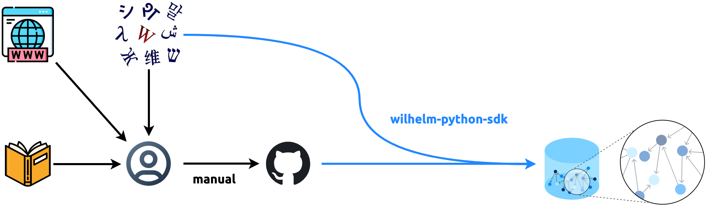

Wilhelm Vocabulary
==================

[![GitHub workflow status badge][GitHub workflow status badge]][GitHub workflow status URL]
[![Apache License Badge]][Apache License, Version 2.0]

<!-- TOC -->
- [Wilhelm Vocabulary](#wilhelm-vocabulary)
  - [Data Format](#data-format)
  - [Data Pipeline](#data-pipeline)
  - [How Data (Vocabulary) is Stored in a Graph Database](#how-data-vocabulary-is-stored-in-a-graph-database)
    - [Why Graph Database](#why-graph-database)
    - [Definition](#definition)
    - [Inflections](#inflections)
  - [Languages](#languages)
    - [German](#german)
      - [YAML Schema](#yaml-schema)
      - [German Declension](#german-declension)
        - [Noun Declension Templates](#noun-declension-templates)
          - [Masculine](#masculine)
          - [Feminine](#feminine)
          - [Neuter](#neuter)
      - [German (Attributive) Adjective Declension](#german-attributive-adjective-declension)
      - [German Conjugation](#german-conjugation)
    - [Ancient Greek](#ancient-greek)
      - [Diacritic Mark Convention](#diacritic-mark-convention)
      - [Greek YAML Schema](#greek-yaml-schema)
      - [Greek Noun](#greek-noun)
      - [Greek Verb](#greek-verb)
    - [Latin](#latin)
    - [Classical Hebrew (Coming Soon)](#classical-hebrew-coming-soon)
    - [Korean](#korean)
  - [License](#license)
<!-- TOC -->

Data Format
-----------

The data that serves [wilhelmlang.com](https://wilhelmlang.com/). They are written in YAML format, because

1. it is machine-readable so that it can be consumed quickly in data pipelines
2. it is human-readable and, thus, easy to read and modify
3. it supports multi-lines value which is very handy for language data

Data Pipeline
-------------



How Data (Vocabulary) is Stored in a Graph Database
---------------------------------------------------

### Why Graph Database

Graph data representation assumes universal connectivity among world entities. This applies pretty well to the realm of
languages. Multilanguage learners have already seen that Indo-European languages are similar in many aspects. The
similarities not only signify the historical facts about Philology but also surface a great opportunity for
multilanguage learners to take advantages of them and study much more efficiently. What's missing is connecting the dots
using Graph Databases that visually presents these vastly enlightening links between the related languages in a natural
way.

### Definition

_The meaning of a word is called the `definition`_. A term has a natural relationship to its definition(s). For example,
the German noun "[Ecke](https://en.wiktionary.org/wiki/Ecke#Noun)" has at least 4 definitions:


<div align="center">
    Graph data generated by <a href="https://github.com/QubitPi/wilhelm-python-sdk">wilhelm-python-sdk</a>
</div>

### Inflections

Indo-European languages are mostly inflected. The way inflections are encoded are documented for each language
separately:

- [German declension](#german-declension)
- [German conjugation](#german-conjugation)
- [Ancient Greek declension](#greek-declension)
- [Ancient Greek conjugation](#greek-conjugation)

Languages
---------

### [German](./german.yaml)

#### YAML Schema

```yaml
vocabulary:
  - term: string
    definition: list
    declension/conjugation: application-specific table
```

- The `conjugation` is the inflection paradigm for a German verb and `declension` the inflection for nouns and
  adjectives. Only one of the two is present for a term.
- The type of the word can be inferred using the following rule

    - `term` with a _definite article_ of __der__/__die__/__das__ signifies a __noun__. For instance

      ```yaml
        - term: die Wissenschaft
          definition: the Science
      ```

    - Those with `conjugation` field denotes a __verb__; its definition also begins with an _indefinite form_, i.e.
      "to ..."
    - The rests are explicitly stated in the `definition` field. For example,

      ```yaml
        - term: ob
          definition:
            - (conj.) if
            - (conj.) whether
      ```

      means "ob" is a **conjunction** in this case and

      ```yaml
        - term: denn
          definition:
            - (adv.) then, thus
            - (conj.) because
      ```

      tells that "denn" can be __adverb__ or __conjunction__

> [!TIP]
>
> The parenthesized value at the beginning of each `definition` item played an un-ignorable role: it is the label of the
> relationship between `term` and `definition` in graph database loaded by
> [Wilhelm SDK](https://github.com/QubitPi/wilhelm-python-sdk). For example, both German words
>
> ```yaml
> - term: denn
>   definition:
>     - (adv.) then, thus
>     - (conj.) because
> ```
>
> and
>
> ```yaml
>  - term: nämlich
>    definition:
>      - (adj.) same
>      - (adv.) namely
>      - (adv.) because
> ```
>
> can mean "because" acting as different types. This is visualized as follows:
>
> 
>
> __Visualzing synonyms this way presents a big advantage to human brain__ who is exceedingly good at memorizing
> patterns

#### German Declension

The declension table employees an [application-specific YAML](https://stackoverflow.com/q/30894438/14312712) that looks
like the following:

```yaml
  - term: ein
    definition: (article) a, an
    declension:
      - ["",         masculine, feminine, neuter, plural]
      - [nominative, ein,       eine,     ein,    N/A   ]
      - [genitive,   eines,     einer,    eines,  N/A   ]
      - [dative,     einem,     einer,    einem,  N/A   ]
      - [accusative, einen,     eine,     ein,    N/A   ]
```

The declension table above is equivalent to

|                | masculine | feminine | neuter | plural |
|:--------------:|:---------:|:--------:|:------:|:------:|
| __nominative__ |    ein    |   eine   |  ein   |  N/A   |
|  __genitive__  |   eines   |  einer   | eines  |  N/A   |
|   __dative__   |   einem   |  einer   | einem  |  N/A   |
| __accusative__ |   einen   |   eine   |  ein   |  N/A   |

> [!NOTE]
>
> - A list under `declension` is a table row
> - All rows have the same number of columns
> - Each element of the list corresponds to a table cell

> [!TIP]
>
> __The declension tables for all nouns are sourced from
> [Wiktionary](https://en.wiktionary.org/wiki/ein#Declension_2)__

##### Noun Declension Templates

###### Masculine

```yaml
    declension:
      - ["",         singular, singular, singular, plural, plural]
      - ["",         indef.,   def.,     noun,     def.,   noun  ]
      - [nominative, ein,      der,      ████████, die,    ██████]
      - [genitive,   eines,    des,      ████████, der,    ██████]
      - [dative,     einem,    dem,      ████████, den,    ██████]
      - [accusative, einen,    den,      ████████, die,    ██████]
```

###### Feminine

```yaml
    declension:
      - ["",         singular, singular, singular, plural, plural]
      - ["",         indef.,   def.,     noun,     def.,   noun  ]
      - [nominative, eine,     die,      ████████, die,    ██████]
      - [genitive,   einer,    der,      ████████, der,    ██████]
      - [dative,     einer,    der,      ████████, den,    ██████]
      - [accusative, eine,     die,      ████████, die,    ██████]
```

###### Neuter

```yaml
    declension:
      - ["",         singular, singular, singular, plural, plural]
      - ["",         indef.,   def.,     noun,     def.,   noun  ]
      - [nominative, ein,      das,      ████████, die,    ██████]
      - [genitive,   eines,    des,      ████████, der,    ██████]
      - [dative,     einem,    dem,      ████████, den,    ██████]
      - [accusative, ein,      das,      ████████, die,    ██████]
```

#### German (Attributive) Adjective Declension

> [!TIP]
>
> - Predicate adjectives (e.g. kalt in mir ist kalt "I am _cold_") are undeclined
> - An adjective can both be predicative (a _brave_ boy) or attributive (The boy is _brave_). Only attributive
>   adjectives are declined.

There are 3 types of declensions for German adjectives

1. [strong declension](https://en.wikipedia.org/wiki/German_declension#Strong_inflection),
2. [week declension](https://en.wikipedia.org/wiki/German_declension#Weak_inflection), and
3. [mixed declension](https://en.wikipedia.org/wiki/German_declension#Mixed_inflection)

Each type bears a separate declension table. __To master German adjectives, we will need to memorize all of the three__.

There is also [adjective comparison](https://en.wikipedia.org/wiki/German_adjectives#Adjective_comparison) which throws
in potentially 6 more tables. But the
[rules for comparative and superlative forms are quite universal](https://www.reddit.com/r/German/comments/i5mfrq/how_do_you_remember_adjective_declension/)
so we __ignore the two and focus only on the positive form__, which is the basic form of the adjective.

The [template](https://www.jetbrains.com/help/idea/generate-custom-code-constructs-using-live-templates.html) of the
adjective is as follows:

```yaml
    declension:
      strong declension (without article):
        - ["",         singular,  singular, singular, plural]
        - ["",         masculine, feminine, neuter,   ""    ]
        - [nominative, █████████, ████████, ████████, ██████]
        - [genitive,   █████████, ████████, ████████, ██████]
        - [dative,     █████████, ████████, ████████, ██████]
        - [accusative, █████████, ████████, ████████, ██████]
      weak declension (with definite article):
        - ["",         singular,  singular, singular, plural]
        - ["",         masculine, feminine, neuter,   ""    ]
        - [nominative, der █████, die ████, das ███,  die ██]
        - [genitive,   des █████, der ████, des ███,  der ██]
        - [dative,     dem █████, der ████, dem ███,  den ██]
        - [accusative, den █████, die ████, das ███,  die ██]
      mixed declension (with indefinite article):
        - ["",         singular,  singular, singular, plural        ]
        - ["",         masculine, feminine, neuter,   ""            ]
        - [nominative, ein █████, eine ███, ein ███,  (keine)  █████]
        - [genitive,   eines ███, einer ██, eines █,  (keiner) █████]
        - [dative,     einem ███, einer ██, einem █,  (keinen) █████]
        - [accusative, einen ███, eine ███, ein ███,  (keine)  █████]
```

Here is an example of the adjective declension for
"[unterschiedlich](https://en.wiktionary.org/wiki/unterschiedlich#Declension)":

```yaml
  - term: unterschiedlich
    definition: (adj.) different
    declension:
      strong declension (without article):
        - ["",         singular,          singular,          singular,          plural           ]
        - ["",         masculine,         feminine,          neuter,            ""               ]
        - [nominative, unterschiedlicher, unterschiedliche,  unterschiedliches, unterschiedliche ]
        - [genitive,   unterschiedlichen, unterschiedlicher, unterschiedlichen, unterschiedlicher]
        - [dative,     unterschiedlichem, unterschiedlicher, unterschiedlichem, unterschiedlichen]
        - [accusative, unterschiedlichen, unterschiedliche,  unterschiedliches, unterschiedliche ]
      weak declension (with definite article):
        - ["",         singular,              singular,              singular,              plural               ]
        - ["",         masculine,             feminine,              neuter,                ""                   ]
        - [nominative, der unterschiedliche,  die unterschiedliche,  das unterschiedliche,  die unterschiedlichen]
        - [genitive,   des unterschiedlichen, der unterschiedlichen, des unterschiedlichen, der unterschiedlichen]
        - [dative,     dem unterschiedlichen, der unterschiedlichen, dem unterschiedlichen, den unterschiedlichen]
        - [accusative, den unterschiedlichen, die unterschiedliche,  das unterschiedliche,  die unterschiedlichen]
      mixed declension (with indefinite article):
        - ["",         singular,                singular,                singular,                plural                    ]
        - ["",         masculine,               feminine,                neuter,                  ""                        ]
        - [nominative, ein unterschiedlicher,   eine unterschiedliche,   ein unterschiedliches,   (keine) unterschiedlichen ]
        - [genitive,   eines unterschiedlichen, einer unterschiedlichen, eines unterschiedlichen, (keiner) unterschiedlichen]
        - [dative,     einem unterschiedlichen, einer unterschiedlichen, einem unterschiedlichen, (keinen) unterschiedlichen]
        - [accusative, einen unterschiedlichen, eine unterschiedliche,   ein unterschiedliches,   (keine) unterschiedlichen ]
```

> [!TIP]
>
> __The declension tables for all adjectives are sourced from
> [Wiktionary](https://en.wiktionary.org/wiki/unterschiedlich#Declension)__

#### German Conjugation

There are __3__ persons, __2__ numbers, and __4__ moods (indicative, conditional, imperative and subjunctive) to
consider in conjugation. There are __6__ tenses in German: the present and past are conjugated, and there are four
compound tenses. There are two categories of verbs in German:
[weak and strong](https://en.wikipedia.org/wiki/Germanic_strong_verb)[^1]. In addition,
[strong verbs are grouped into 7 "classes"](https://en.wikipedia.org/wiki/Germanic_strong_verb#Strong_verb_classes)

[^1]: https://en.wikipedia.org/wiki/German_verbs#Conjugation

The conjugation table of German verb on Wiktionary is hard to interpret for German beginner. It does, however, presents
a very good Philology reference. For example, it tells us which of the 7 "classes" a strong verb belongs to. __We,
therefore, leave the Wiktionary links to the conjugation table of that verb for data processing in the future__, for
example,

```yaml
  - term: aufwachsen
    definition: to grow up
    conjugation: https://en.wiktionary.org/wiki/aufwachsen#Conjugation
```

and advise user to employ a much more practical method to learn daily conjugation as follows. We take "__aufwachsen__"
as an example.

> [!IMPORTANT]
> I'm not advertising for any organizations. I'm simply sharing good resources.

[Netzverb Dictionary](https://www.verbformen.com/) is the best German dictionary _targeting the vocabulary inflections_.
[Search for "aufwachsen"](https://www.verbformen.com/?w=aufwachsen) and we will see much more intuitive conjugation
tables listed.

This pretty much serves our needs, but what makes Netzverb unpenetrable by other alternatives is that _every_ verb comes
with

1. [A printable version that looks much better than the browser's Control+P export](https://www.verbformen.com/conjugation/aufwachsen.pdf)

   - There is also a "Sentences with German verb aufwachsen" section with a
     [link](https://www.verbformen.com/conjugation/examples/aufwachsen.htm) that offer a fruitful number of conjugated
     examples getting us familiar with the inflections of the verb

2. [An on-the-fly generated flashcard sheet](https://www.verbformen.com/conjugation/worksheets-exercises/lernkarten/aufwachsen.pdf)
   which allows us to make a better usage of our random free time
3. [A YouTube video that offers audios of almost every conjugated form](https://www.youtube.com/watch?v=LCtUrSn030A),
   which helps with pronunciations a lot

> [!TIP]
>
> - __It is, thus, strongly recommended to study the conjugation through
>   [Netzverb Dictionary](https://www.verbformen.com/) separately__
> - Netzverb Dictionary, however, lacks a programmable API. Wiktionary [has a good one](https://dumps.wikimedia.org/)
>   instead. This is why we left the conjugation link to Wiktionary for now and it will definitely serve us well as I'm
>   trying to make it happen

### [Ancient Greek](./greek.yaml)

> [!TIP]
>
> [Wiktionary](https://en.wiktionary.org/wiki/%CE%B1%E1%BD%90%CF%84%CF%8C%CF%82#Pronunciation) and
> [Logos Bible Study Platform](https://www.youtube.com/@logosbiblesoftware/search?query=Greek) are the best sources as
> pronunciation guides. Due to the scarcity of the audio resources among AG lerners, [a separate project](https://github.com/QubitPi/ancient-greek-reader) has been
> initiated to expand the audio practice materials by AI

[Ancient Greek is still an under-attesting language](https://latin.stackexchange.com/a/17432), what that means is no
textbook is "complete". One will frequently see a certain grammar does not apply to or some inflections are missing for
a word. Therefore, the best strategy to make inflection data of Ancient Greek is to crawl the entire inflection table of
every word. This would be impractical manually but practical automatically using
[wilhelm-python-sdk](https://github.com/QubitPi/wilhelm-python-sdk). The sections below will make references to the
certain parts of SDK.

#### Diacritic Mark Convention

We employ the following 3 diacritic signs only in vocabulary:

1. the __acute__ (ά)
2. the __circumflex__ (ᾶ), and
3. the __grave__ (ὰ)

In fact, it is called the [_medium diacritics_](https://lsj.gr/wiki/%E1%BC%80%CE%B3%CE%B1%CE%B8%CF%8C%CF%82)  and the
same convention used in [Loeb Classical Library prints](https://ryanfb.xyz/loebolus/) from Harvard. Notice that,
however, the commonly sourced [Wiktionary uses full diacritics](https://en.wiktionary.org/wiki/%E1%BC%80%CE%B3%CE%B1%CE%B8%CF%8C%CF%82#Declension),
including the [breve diacritic mark](https://en.wikipedia.org/wiki/Breve); we don't do that.

#### Greek YAML Schema

#### Greek Noun

The vocabulary entry for each noun consists of its nominative and genitive forms, an article which indicates the noun's
gender, and the English meaning. For example.

```yaml
  - term: τέχνη τέχνης, ἡ
    definition:
      - art,
      - skill,
      - craft
```

the vocabulary entry above consists of the following 4 items:

1. τέχνη: nominative singular
2. τέχνης: genitive singular
3. ἡ: nominative feminine singular of the article, which shows that the gender of the noun is feminine
4. a list of English meanings of the word

The declension of the entry is not shown because to decline any noun, we can take the genitive singular, remove the
genitive singular ending to get the stem, and then add the proper set of endings to the stem based on its declension
class[^2].

[^2]: _[Greek: An Intensive Course, 2nd Revised Edition](https://www.amazon.com/Greek-Intensive-Course-2nd-Revised/dp/0823216632)_, Hansen & Quinn, _p.20_

For example, to decline _τέχνη τέχνης, ἡ, art_, take the genitive singular _τέχνης_, remove the genitive singular ending
_-ης_, and add the appropriate endings to the stem which gives following paradigm:

|    Case    | Singular | Plural  |
|:----------:|:--------:|:-------:|
| nominative |  τέχνη   | τέχναι  |
|  genitive  |  τέχνης  | τεχνῶν  |
|   dative   |  τέχνῃ   | τέχναις |
| accusative |  τέχνην  | τέχνᾱς  |
|  vocative  |  τέχνη   | τέχναι  |

#### Greek Verb

The Greek verb has __6__ principal parts. All 6 must be learned whenever a new verb is encountered:

1. (first person singular) present indicative active
2. (first person singular) future indicative active
3. (first person singular) aorist indicative active
4. (first person singular) perfect indicative active
5. (first person singular) perfect indicative passive
6. (first person singular) aorist indicative passive

> [!TIP]
>
> The minimum number of forms which one must know in order to generate all possible forms of a verb are called the
> __principal parts__ of that verb.

From the 6 forms above, various verb forms (i.e. stems & endings) can be derived by rules[^4]

[^4]: _[Greek: An Intensive Course, 2nd Revised Edition](https://www.amazon.com/Greek-Intensive-Course-2nd-Revised/dp/0823216632)_, Hansen & Quinn, _p.44_

In practice, however,
[obtaining precise and complete principal parts for some verbs has been proven to be impossible](https://latin.stackexchange.com/a/17432).
While the best efforts have been made for reconstructing the complete principal parts, we also put a link to the
Wiktionary of each verb for
[wilhelm-python-sdk](https://sdk.wilhelmlang.com/en/latest/#module-wilhelm_python_sdk.ancient_greek_wiktionary_parser),
which will dynamically load the complete conjugation tables into graph database.

What's also being loaded are the reconstructed principal parts with a list of references that validate the
reconstruction.

In conclusion, the entry of a verb, thus, has the form of:

```yaml
  - term: string
    definition: list
    conjugation:
      wiktionary: string
      principal parts:
        - ["",                                                 Attic, (Possibly other dialects)]
        - [(first person singular) present indicative active,  █████, ...                      ]
        - [(first person singular) future indicative active,   █████, ...                      ]
        - [(first person singular) aorist indicative active,   █████, ...                      ]
        - [(first person singular) perfect indicative active,  █████, ...                      ]
        - [(first person singular) perfect indicative passive, █████, ...                      ]
        - [(first person singular) aorist indicative passive,  █████, ...                      ]
      references: list
```

For example:

```yaml
  - term: λέγω
    definition:
      - to say, speak
      - to pick up
    conjugation:
      wiktionary: https://en.wiktionary.org/wiki/λέγω#Verb_2
      principal parts:
        - ["",                                                 Attic    , Koine          ]
        - [(first person singular) present indicative active,  λέγω     , λέγω           ]
        - [(first person singular) future indicative active,   λέξω     , ἐρῶ            ]
        - [(first person singular) aorist indicative active,   ἔλεξα    , εἶπον/εἶπα     ]
        - [(first person singular) perfect indicative active,  (missing), εἴρηκα         ]
        - [(first person singular) perfect indicative passive, λέλεγμαι , λέλεγμαι       ]
        - [(first person singular) aorist indicative passive,  ἐλέχθην  , ἐρρέθην/ἐρρήθην]
      references:
        - https://en.wiktionary.org/wiki/λέγω#Inflection
        - http://atticgreek.org/downloads/allPPbytypes.pdf
        - https://books.openbookpublishers.com/10.11647/obp.0264/ch25.xhtml
        - https://www.billmounce.com/greek-dictionary/lego
        - https://koine-greek.fandom.com/wiki/Λέγω
```

### [Latin](./latin.yaml)

```yaml
vocabulary:
  - term: string
    definition: list
```

### Classical Hebrew (Coming Soon)

The vocabulary is presented to help read and understand [Biblical Hebrew](https://mechon-mamre.org/p/pt/pt00.htm#mp3). A
[complementary audio](https://mechon-mamre.org/p/pt/ptmp3prq.htm) helps well with the pronunciation.

### [Korean](./korean.yaml)

中国人学习韩语有先天优势，加之韩语本身也是一门相当简单的语言，所以这里将语法和词汇合并在一起；
每一项也只由 `term`（韩）和 `definition`（中）组成，

```yaml
vocabulary:
  - term: string
    definition: list of strings
    example:
      - Korean: 제가 아무렴 그쪽 편에 서겠어요
        Chinese: 我无论如何都会站在你这边
      - Korean: ...
        Chinese: ...
```

不用费太多功夫记牢简单的语法和词汇，剩下的就是拿韩语字幕剧不停练习听说读写既成。`example` 中的例句均来自[韩国本土语料](https://www.amazon.com/Korean-book-%EB%82%98%EC%9D%98-%EC%95%84%EC%A0%80%EC%94%A8-%EC%A0%842%EA%B6%8C/dp/8933871756)

> [!NOTE]
>
> 韩语不属于汉藏语系，因其所属语系非常狭小，无法和其它语言产生足够关联，因此其数据暂时不被存入图数据库进行数据分析

License
-------

The use and distribution terms for [wilhelm-vocabulary]() are covered by the [Apache License, Version 2.0].

[Apache License Badge]: https://img.shields.io/badge/Apache%202.0-F25910.svg?style=for-the-badge&logo=Apache&logoColor=white
[Apache License, Version 2.0]: https://www.apache.org/licenses/LICENSE-2.0

[GitHub workflow status badge]: https://img.shields.io/github/actions/workflow/status/QubitPi/wilhelm-vocabulary/ci-cd.yaml?branch=master&style=for-the-badge&logo=github&logoColor=white&label=Database%20Loading
[GitHub workflow status URL]: https://github.com/QubitPi/wilhelm-vocabulary/actions/workflows/ci-cd.yaml
