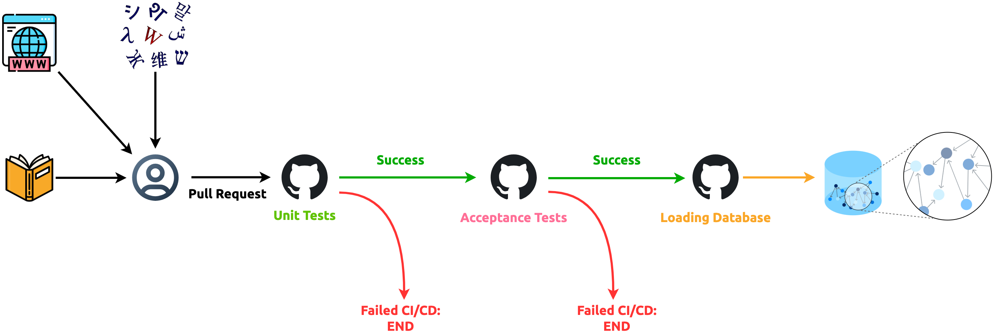

Antiqua Acceptance Tests Framework
==================================

[![Cucumber Badge][Cucumber Badge]][Cucumber]

Antiqua's __acceptance-tests__ is a reusable "gatekeeper" test framework between Antiqua and Neo4J Graph database. It
runs [acceptance tests](https://cucumber-bdd.netlify.app/docs/bdd/) to make sure the data within
[Antiqua on Hugging Face Datasets][Hugging Face dataset URL] encode the expected knowledge graphs

All acceptance tests are within the [*.feature](./features) files, which are the standard [Cucumber] test specs

[Cucumber]: https://cucumber-bdd.netlify.app/
[Cucumber Badge]: https://img.shields.io/badge/Cucumber-23D96C.svg?style=for-the-badge&logo=cucumber&logoColor=white

[Hugging Face dataset URL]: https://huggingface.co/datasets/QubitPi/Antiqua
